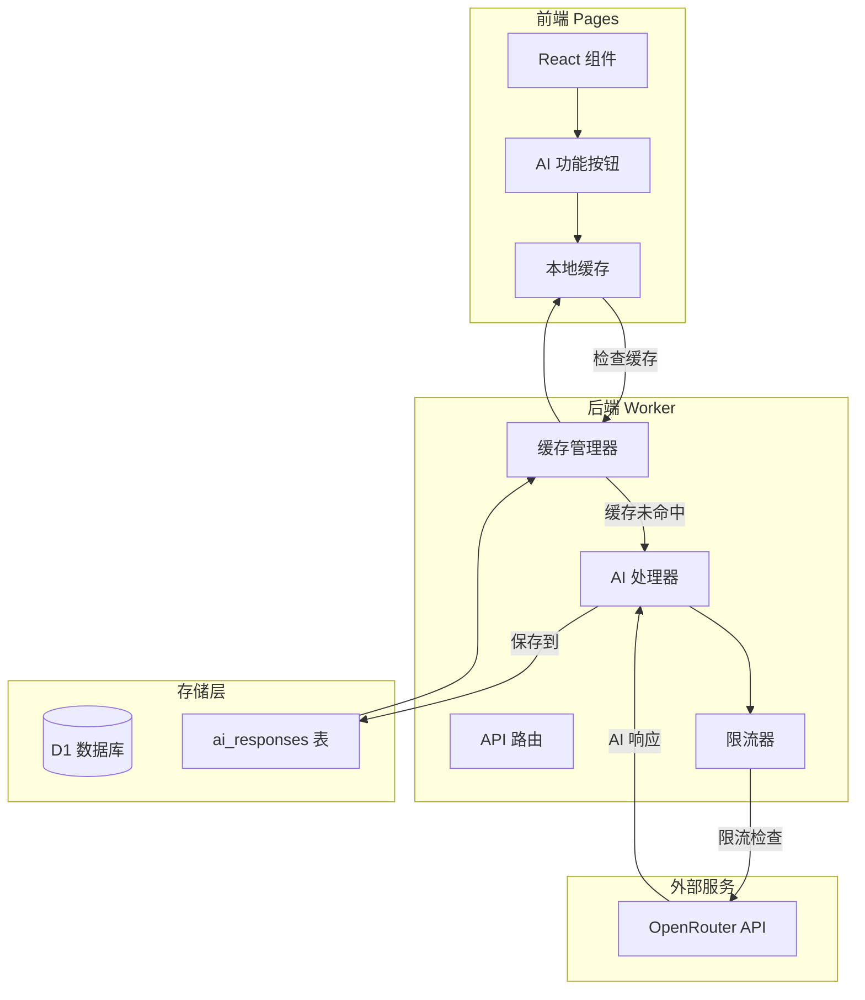

# AI 功能集成技术设计

Feature Name: ai-features-integration
Updated: 2026-04-20

## 描述

为 Love Space 集成完整的 AI 能力，使用 OpenRouter API（openrouter/elephant-alpha 模型）作为 AI 引擎。设计包含缓存层避免重复调用，前端深度集成到各个页面，确保隐私安全和性能优化。

## 架构



## 组件和接口

### 1. 后端组件（Worker）

#### 1.1 AI 服务模块 (`src/services/ai.js`)

```javascript
// 核心功能
- OpenRouter API 调用
- 请求限流（每用户每天 100 次）
- 错误重试（指数退避）
- 超时控制（30 秒）
- 缓存管理（request_hash）
```

#### 1.2 API 处理器 (`src/handlers/ai.js`)

```javascript
// API 端点
POST /api/ai/analyze-mood      - 情感分析
POST /api/ai/generate-photo-desc - 照片描述
POST /api/ai/polish-message    - 留言润色
POST /api/ai/plan-date         - 约会策划
POST /api/ai/generate-topic    - 话题生成
GET  /api/ai/usage             - 使用量查询
DELETE /api/ai/cache           - 清除缓存
```

#### 1.3 Prompt 模板库 (`src/prompts/`)

```
prompts/
├── mood-analysis.js      - 情感分析提示词
├── photo-description.js  - 照片描述提示词
├── message-polish.js     - 留言润色提示词
├── date-planning.js      - 约会策划提示词
└── topic-generation.js   - 话题生成提示词
```

### 2. 前端组件（Pages）

#### 2.1 AI 功能按钮组件 (`src/components/AIButton.jsx`)

```javascript
// 统一样式的 AI 按钮
props: {
  type: 'analyze' | 'generate' | 'polish' | 'plan',
  onGenerate: (result) => void,
  loading: boolean,
  disabled: boolean
}
```

#### 2.2 页面集成点

| 页面 | AI 功能 | 触发方式 |
|------|--------|----------|
| HomePage | 关系周报 | 卡片按钮 |
| MoodsPage | 情感分析 | 图表旁按钮 |
| GalleryPage | 照片描述 | 上传后弹窗 |
| MessagesPage | 留言润色 | 编辑器工具栏 |
| DailyPage | 话题生成 | 顶部开关 |
| SettingsPage | AI 设置 | 独立设置页 |

### 3. 数据模型

#### 3.1 ai_responses 表

```sql
CREATE TABLE ai_responses (
  id INTEGER PRIMARY KEY AUTOINCREMENT,
  user_id TEXT NOT NULL,
  request_type TEXT NOT NULL,  -- 'mood' | 'photo' | 'message' | 'date' | 'topic'
  request_hash TEXT NOT NULL,  -- MD5(request_type + request_content)
  response_content TEXT NOT NULL,
  created_at DATETIME DEFAULT CURRENT_TIMESTAMP,
  expires_at DATETIME NOT NULL,  -- created_at + 30 days
  metadata TEXT,  -- JSON 额外信息
  
  INDEX idx_user_type (user_id, request_type),
  INDEX idx_hash (request_hash),
  INDEX idx_expires (expires_at)
);
```

#### 3.2 daily_questions 表扩展

```sql
ALTER TABLE daily_questions ADD COLUMN ai_generated BOOLEAN DEFAULT FALSE;
ALTER TABLE daily_questions ADD COLUMN category TEXT;  -- 'deep' | 'fun' | 'memory' | 'future'
```

### 4. 错误处理

| 错误类型 | 处理策略 |
|----------|----------|
| API Key 无效 | 禁用 AI 功能，显示配置提示 |
| 速率限制 | 队列等待，10 秒后重试 |
| 超时 | 指数退避重试（3 次），失败后显示缓存 |
| 缓存未命中 | 调用 API，保存结果 |
| 网络错误 | 显示友好提示，建议稍后重试 |

### 5. 正确性属性

1. **缓存一致性**：相同 request_hash 必须返回相同响应
2. **限流准确性**：每用户每天不超过 100 次 API 调用
3. **数据隔离**：每个用户只能访问自己的 AI 数据
4. **过期清理**：过期缓存自动清理（Cron 任务）
5. **隐私保护**：敏感信息不上报 API

## 接口定义

### OpenRouter API 调用格式

```javascript
const response = await fetch('https://openrouter.ai/api/v1/chat/completions', {
  method: 'POST',
  headers: {
    'Authorization': `Bearer ${OPENROUTER_API_KEY}`,
    'Content-Type': 'application/json',
    'HTTP-Referer': 'https://love-space.pages.dev',
    'X-Title': 'Love Space'
  },
  body: JSON.stringify({
    model: 'openrouter/elephant-alpha',
    messages: [
      {
        role: 'system',
        content: '你是一对情侣关系的情感助手，用温暖、支持性的语气提供建议。'
      },
      {
        role: 'user',
        content: '具体的提示词内容'
      }
    ],
    max_tokens: 500,
    temperature: 0.7
  })
});
```

## 测试策略

### 单元测试

```javascript
// AI 服务测试
- 缓存命中/未命中逻辑
- 限流器准确性
- 错误重试机制
- Prompt 模板渲染
```

### 集成测试

```javascript
// 端到端测试
- 上传照片 → AI 生成描述 → 保存到数据库
- 写留言 → AI 润色 → 显示多种风格
- 查看心情 → AI 分析 → 生成周报
```

### 性能测试

```javascript
// 压力测试
- 并发 10 个 AI 请求
- 缓存命中率验证
- API 超时处理
```

## 部署说明

### 环境变量（Wrangler）

```toml
[vars]
OPENROUTER_API_KEY = "sk-or-v1-xxx"
AI_RATE_LIMIT = 100
AI_CACHE_DAYS = 30
AI_TIMEOUT_MS = 30000
```

### 数据库迁移

```sql
-- 执行 schema 扩展
CREATE TABLE ai_responses (...);
ALTER TABLE daily_questions ADD COLUMN ai_generated BOOLEAN;
ALTER TABLE daily_questions ADD COLUMN category TEXT;
```

## 参考文献

[^1]: (OpenRouter API Docs) - [https://openrouter.ai/docs](https://openrouter.ai/docs)
[^2]: (Worker AI Handler) - [`worker/src/handlers/ai.js`](worker/src/handlers/ai.js)
[^3]: (Database Schema) - [`worker/schema.sql`](worker/schema.sql)
