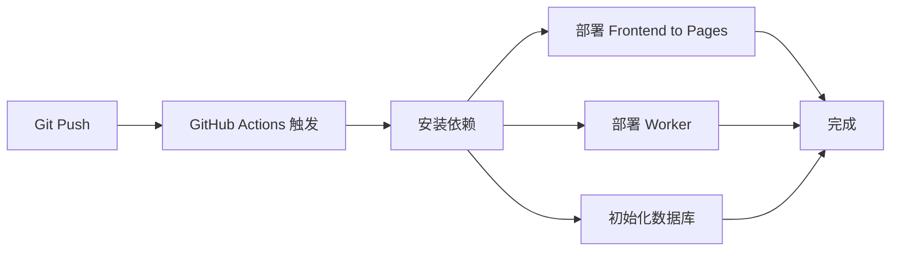

# GitHub Secrets 配置指南

## 🔑 获取 Cloudflare API Token

### 步骤 1：创建 API Token

1. 访问 https://dash.cloudflare.com/profile/api-tokens
2. 点击 **Create Token**
3. 选择 **Edit Cloudflare Workers** 模板
4. 点击 **Continue to summary**

### 步骤 2：配置权限

确保包含以下权限：

```
Zone:
  - Zone: Read
  - Cache Purge: Edit
  - Workers Scripts: Edit
  - Workers Routes: Edit
  - Workers KV Storage: Edit

Account:
  - Account Settings: Read
  - Workers KV Storage: Edit
  - D1: Edit
  - R2: Edit

Organization:
  - Organization Settings: Read
```

### 步骤 3：添加 IP 白名单（可选）

如果需要，可以限制 API Token 只能从特定 IP 使用。

### 步骤 4：复制 Token

点击 **Create Token**，复制生成的 Token
**⚠️ 只显示一次，立即保存！**

---

## 🔐 配置 GitHub Secrets

### 方式 1：通过 GitHub Dashboard

1. 访问 https://github.com/Hjjjkh/sweetspace/settings/secrets/actions
2. 点击 **New repository secret**
3. 添加以下 secrets:

| Name | Value |
|------|-------|
| `CLOUDFLARE_API_TOKEN` | 刚才创建的 API Token |
| `CLOUDFLARE_ACCOUNT_ID` | 你的 Cloudflare 账户 ID |
| `CLOUDFLARE_EMAIL` | 你的 Cloudflare 邮箱 |

### 方式 2：通过 GitHub CLI

```bash
# 安装 GitHub CLI
gh auth login

# 添加 secrets
gh secret set CLOUDFLARE_API_TOKEN
gh secret set CLOUDFLARE_ACCOUNT_ID
gh secret set CLOUDFLARE_EMAIL
```

---

## 📊 获取 Cloudflare Account ID

### 方法 1：Dashboard

1. 访问 https://dash.cloudflare.com/
2. 右侧边栏底部的 **Account ID** 就是

### 方法 2：API

```bash
curl -X GET "https://api.cloudflare.com/client/v4/user/tokens/verify" \
  -H "Authorization: Bearer YOUR_API_TOKEN" \
  -H "Content-Type: application/json"
```

---

## ✅ 验证配置

推送代码触发自动部署：

```bash
# 创建一个测试提交
echo "# Test" >> README.md
git add .
git commit -m "Test auto deploy"
git push
```

访问 GitHub Actions 查看部署状态：
https://github.com/Hjjjkh/sweetspace/actions

---

## 🎯 自动部署流程

配置完成后：



---

## 📝 环境变量说明

### 必需的环境变量

| Variable | Required | Description |
|----------|----------|-------------|
| `CLOUDFLARE_API_TOKEN` | ✅ | Cloudflare API Token |
| `CLOUDFLARE_ACCOUNT_ID` | ✅ | Cloudflare 账户 ID |
| `CLOUDFLARE_EMAIL` | ❌ | Cloudflare 邮箱（用于日志） |

---

## 🚨 故障排查

### 问题：部署失败

**检查点：**
1. API Token 是否正确
2. Account ID 是否正确
3. 仓库是否有 secrets
4. GitHub Actions 是否启用

### 问题：Pages 部署成功但访问 404

**解决：**
1. 检查 Build output directory 是否为 `dist`
2. 检查 Root directory 是否为 `frontend`
3. 查看 Pages 部署日志

### 问题：Worker 部署失败

**解决：**
1. 检查 D1 数据库是否已创建
2. 检查 R2 存储桶是否已创建
3. 查看 Worker 部署日志

---

## 💡 最佳实践

1. **定期轮换 API Token** - 每 90 天更新一次
2. **使用最小权限** - 只授予必要的权限
3. **启用部署通知** - 在 GitHub 配置邮件通知
4. **保护主分支** - 设置 branch protection rules

---

## 📚 相关文档

- [Cloudflare API 文档](https://developers.cloudflare.com/fundamentals/api/)
- [GitHub Actions 文档](https://docs.github.com/en/actions)
- [wrangler-action](https://github.com/cloudflare/wrangler-action)
